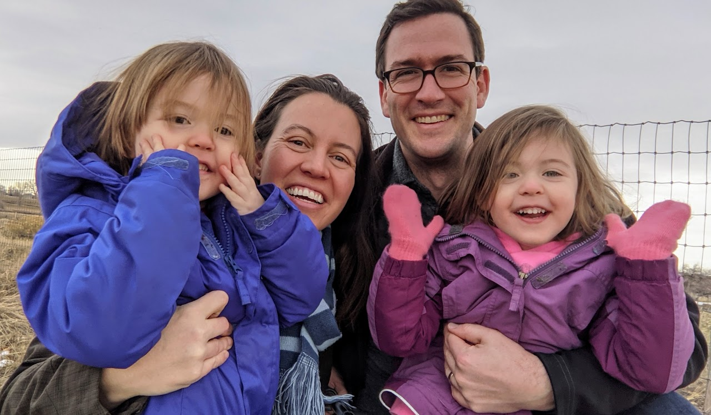

# About Mr. Bowman

I am the father of twin 4-year-old girls that were born in Jordan, where my family has lived since 2016. I was born in Kansas and lived most of my life in Colorado in the United States. I've been teaching high school and living abroad for over 10 years in South Korea, Kuwait, and Jordan. 

Other than Computer Science, I teach or have taught English, film appreciation, audio and video production, and photography, which reflects the fact that I've always had broad interests, ranging from literature to music to technology to film, and I enjoy learning new skills, tinkering, and fixing things. 
